# CineSpoilers

## Descripción

CineSpoilers es una API REST desarrollada con Django y Django REST Framework que permite gestionar un catálogo de películas. El proyecto implementa operaciones CRUD (Crear, Leer, Actualizar, Eliminar) para el modelo de Película.

## Características

- **Modelo de Película**: Incluye campos como título, sinopsis, duración en minutos, fecha de lanzamiento, estado activo, y timestamps de creación y actualización.
- **API RESTful**: Endpoints para gestionar películas con operaciones CRUD completas.
- **Serialización**: Uso de serializers de DRF para validar y formatear los datos.
- **Base de Datos**: SQLite por defecto, con migraciones de Django.

## Modelo de Datos

### Movie
- `id`: Identificador único (auto-generado)
- `title`: Título de la película (CharField, max 255 caracteres)
- `synopsis`: Sinopsis de la película (TextField)
- `duration_minutes`: Duración en minutos (PositiveIntegerField)
- `release_date`: Fecha de lanzamiento (DateField)
- `is_active`: Estado activo (BooleanField, por defecto True)
- `created_at`: Fecha de creación (DateTimeField, auto_now_add)
- `updated_at`: Fecha de actualización (DateTimeField, auto_now)

## Endpoints de la API

La API está disponible bajo el prefijo `/api/`. Los endpoints para películas son:

- `GET /api/movies/`: Lista todas las películas activas
- `POST /api/movies/`: Crea una nueva película
- `GET /api/movies/{id}/`: Obtiene detalles de una película específica
- `PUT /api/movies/{id}/`: Actualiza una película completa
- `PATCH /api/movies/{id}/`: Actualiza parcialmente una película
- `DELETE /api/movies/{id}/`: Elimina una película

## Evidencia de Trabajo

### Jilder Dionisio ROJAS

#### Entregables

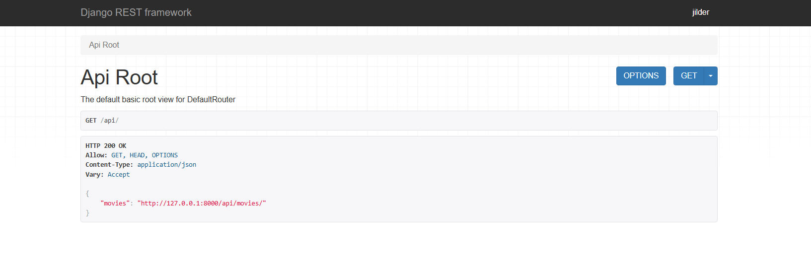
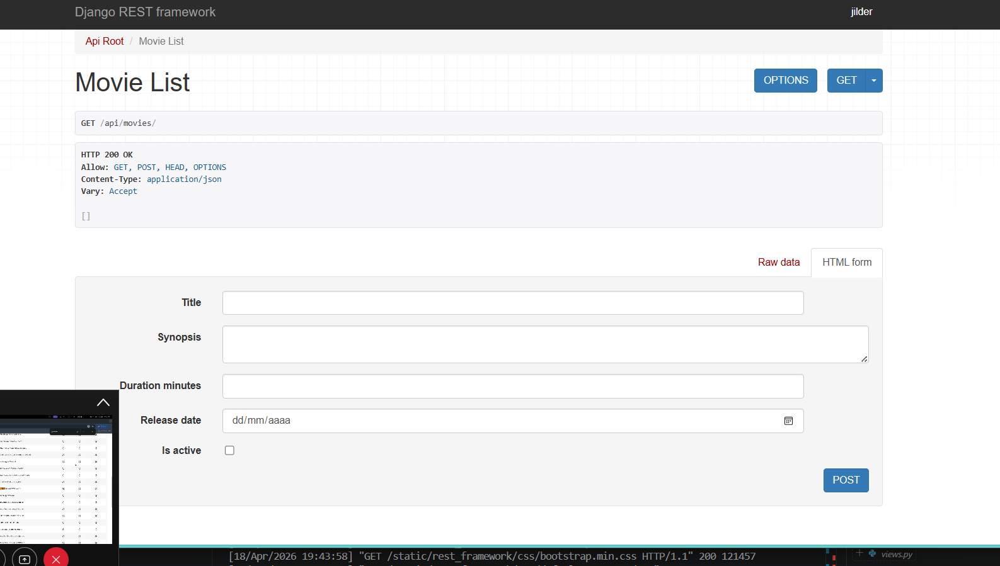

#### Operaciones en Base de Datos - GET (Listar películas)
- Cambio en la base de datos 
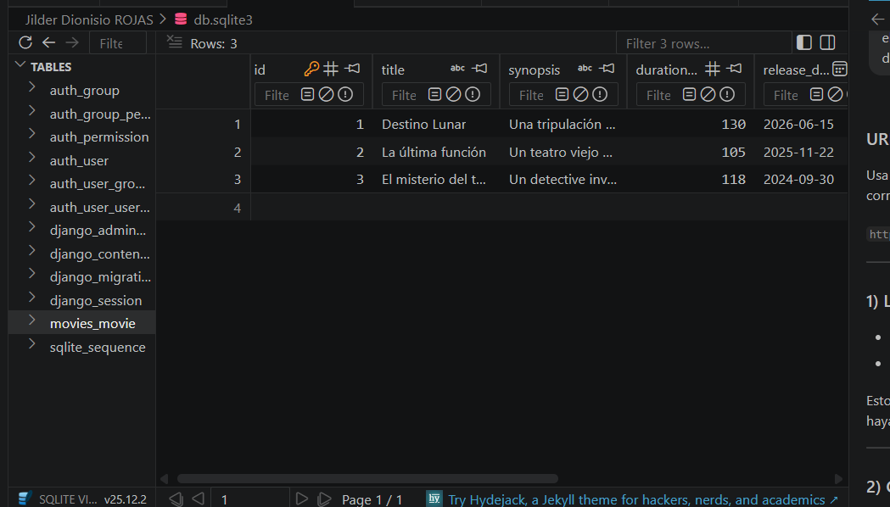
- Consulta en postamn 
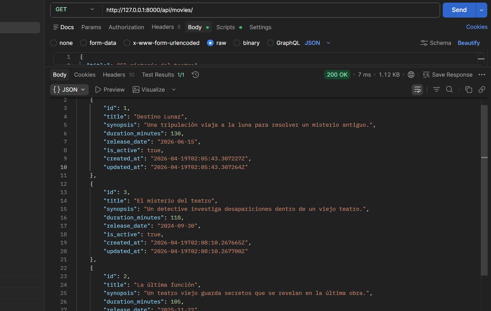

#### Operaciones en Base de Datos - POST (Crear película)

- Cambio en la base de datos
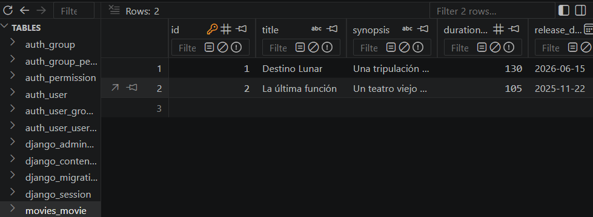
- Consulta en postman
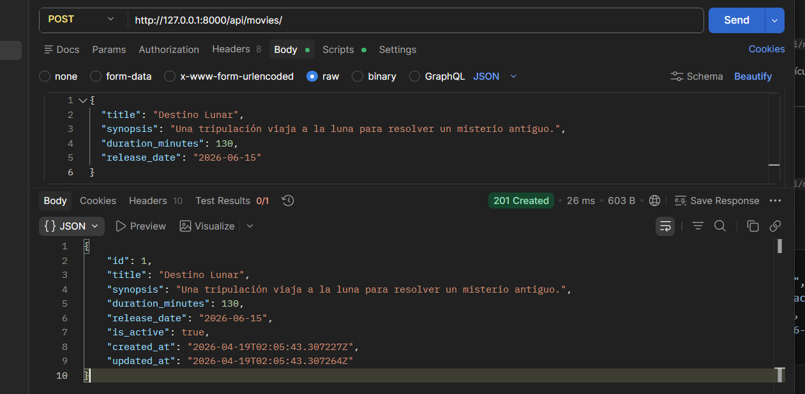

#### Operaciones en Base de Datos - PUT (Actualizar película)

- Cambio en la base de datos
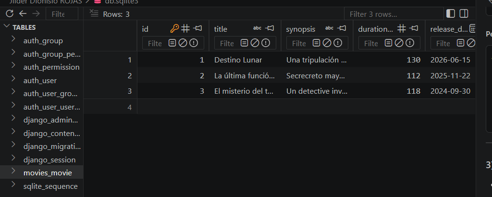
- Consulta en postman
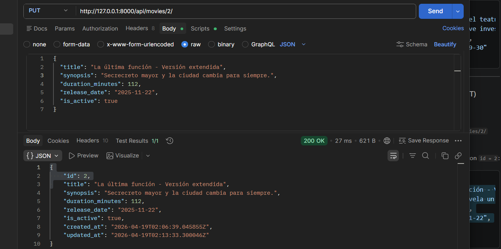

#### Operaciones en Base de Datos - DELETE (Eliminar película)

- Cambio en la base de datos
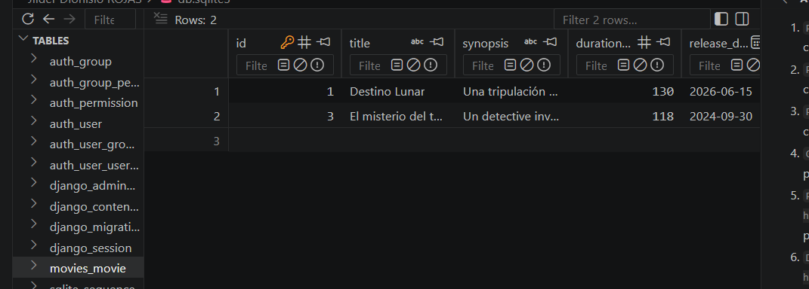
- Consulta en postman
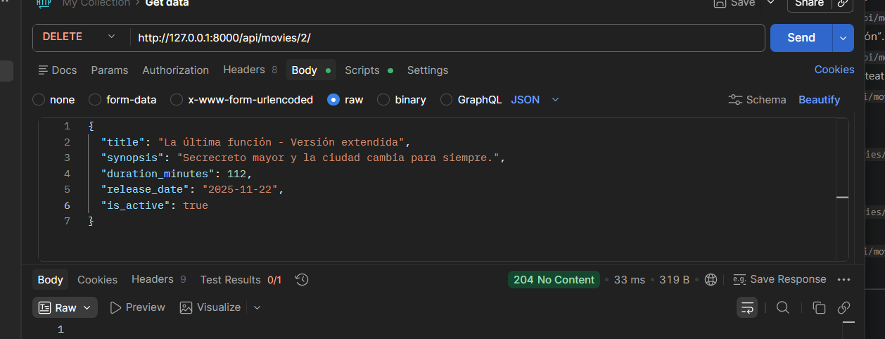

- **Naomi Veliz**
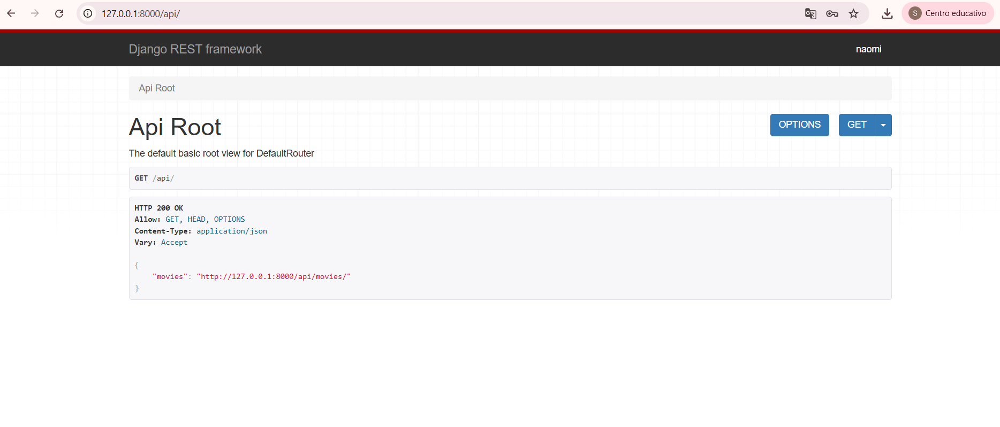
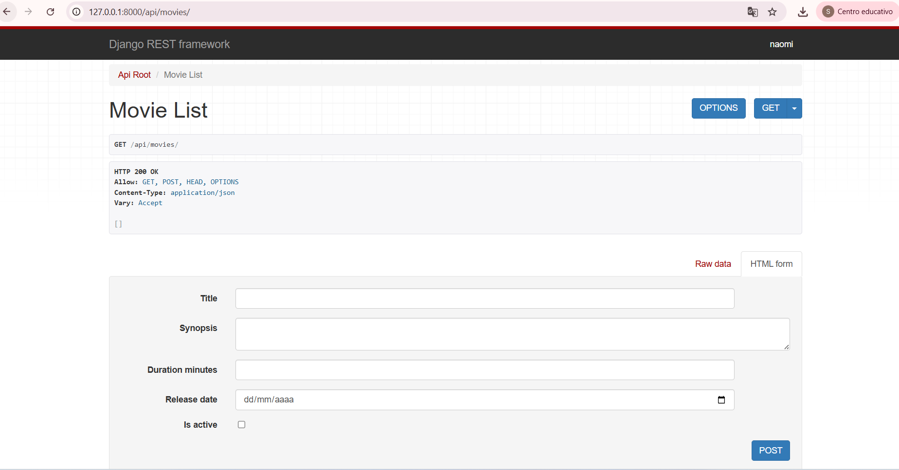
#### Operaciones en Base de Datos - GET (Listar películas)
- Añadir películas
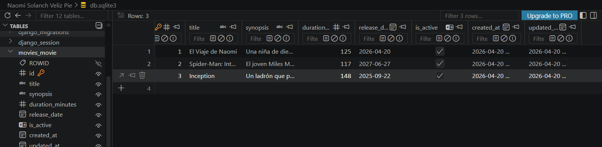
- Consulta en postamn 
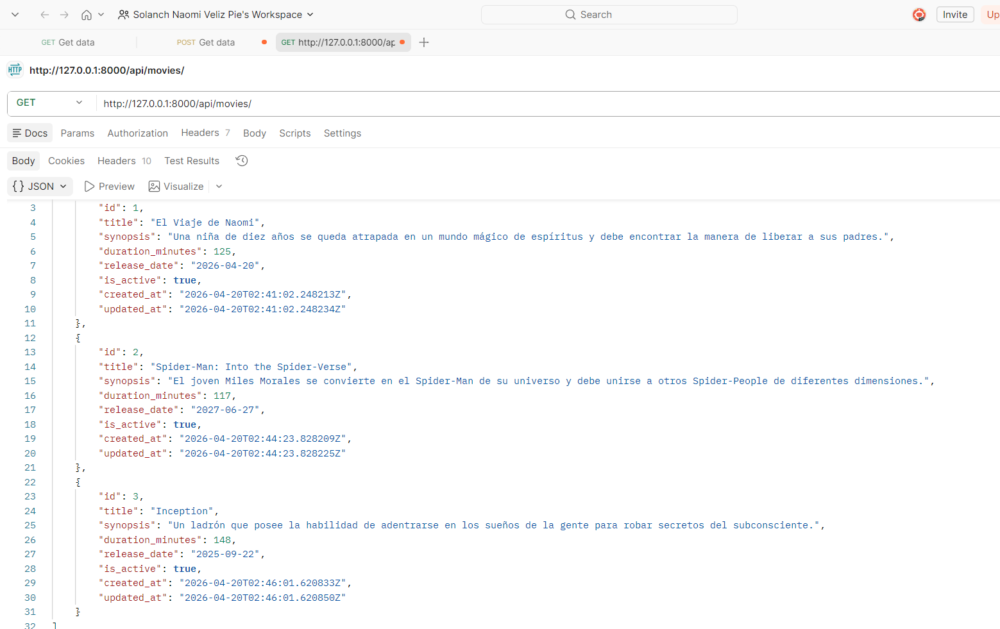
#### Operaciones en Base de Datos - POST (Crear película)
 -Usando POST en postamn 
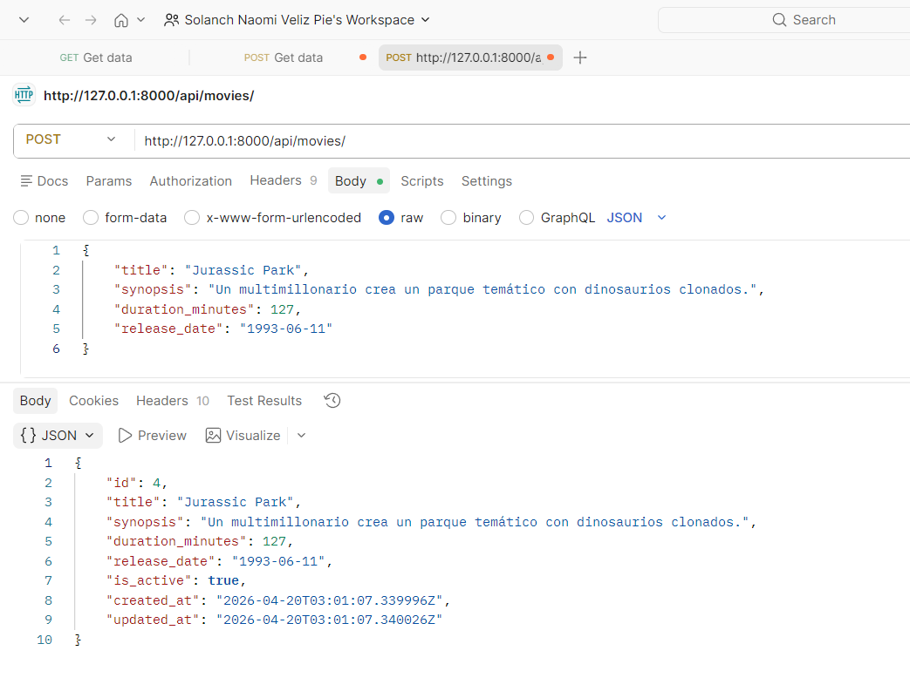
-Cambio en la base de datos
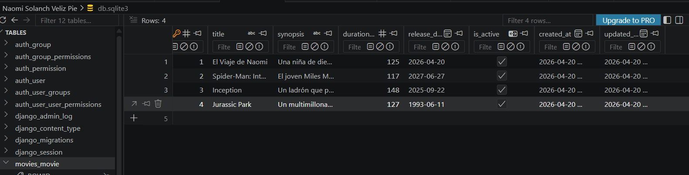
#### Operaciones en Base de Datos - PUT (Actualizar película)
-Usando PUT en postamn 
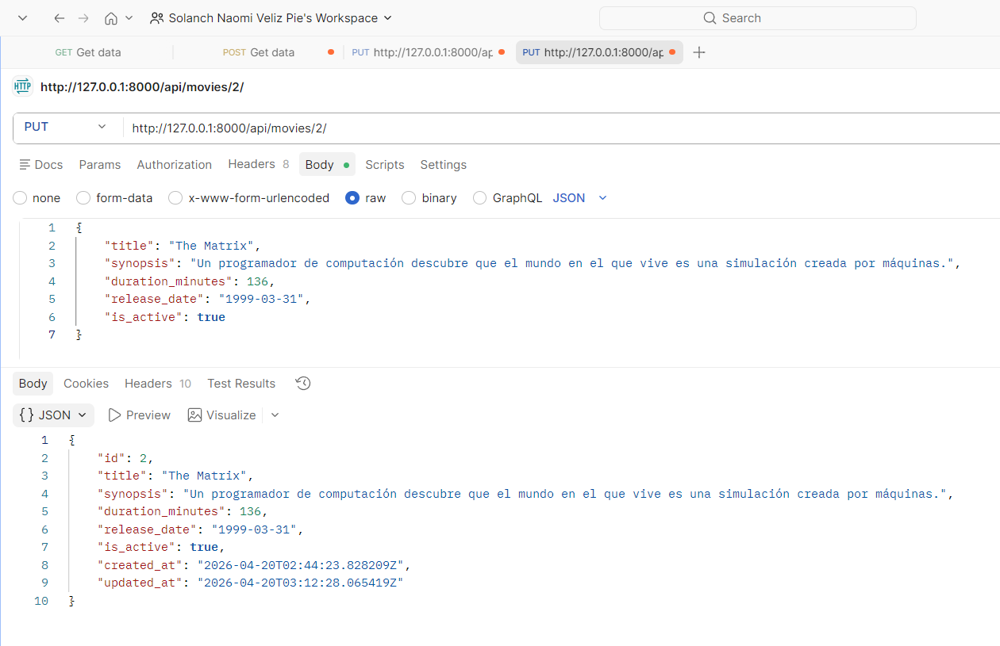
-Cambios en la base de datos
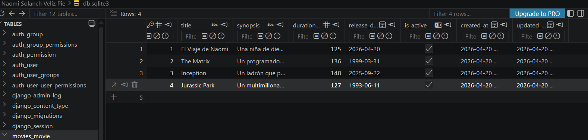
#### Operaciones en Base de Datos - DELETE (Eliminar película)
-Usando DELETE en postamn 
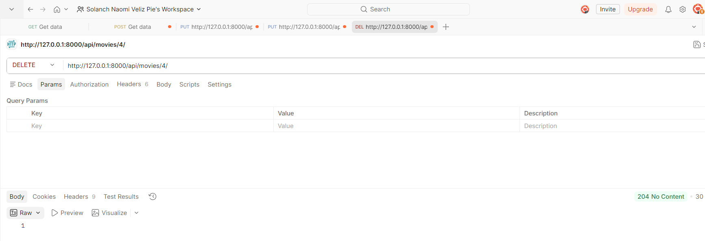
-Cambios en la base de datos
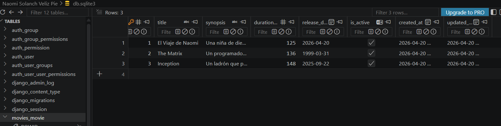

- **Adrina Chinchayguara**

Cada miembro contribuyó en las diferentes fases del desarrollo, incluyendo el diseño del modelo, implementación de la API y documentación.